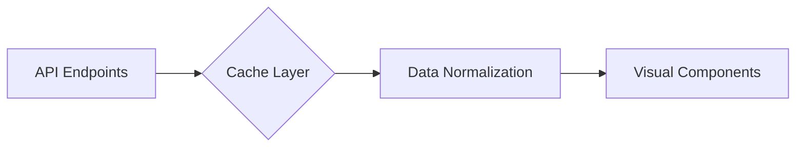
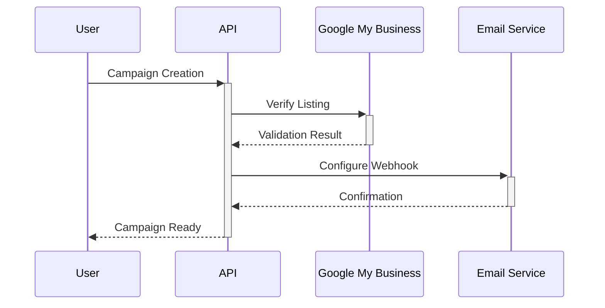
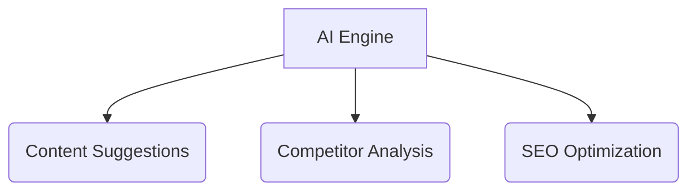

# LocalBiz Marketing Platform Documentation

## Project Overview

**Target Audience**: Local service professionals (plumbers, lawyers, doctors) needing ROI-focused
marketing solutions

**Core Value Proposition**:

- Profession-specific marketing templates
- Data-driven campaign management
- Performance analytics with financial metrics
- Multi-channel integration capabilities

## Technical Architecture

### Frontend Stack

| Layer         | Technologies                    |
| ------------- | ------------------------------- |
| Core          | React 18 + TypeScript           |
| State         | Context API + React Hooks       |
| Styling       | CSS Modules + Styled Components |
| Routing       | React Router v7                 |
| Build         | Vite + Rollup                   |
| Visualization | Recharts                        |


## Key Modules

### 1. Campaign Management System

```jsx
// Example CampaignBuilder component structure
const CampaignWizard = () => {
    const { state, dispatch } = useCampaignContext();
    // Wizard steps implementation
};
```

**Data Flow**:

1. User inputs campaign parameters
2. Context API updates global state
3. Budget calculator computes ROI projections
4. Directory APIs validate business listings

### 2. Analytics Dashboard

**Data Pipeline**:



**Key Metrics**:

- Cost-Per-Lead (CPL)
- Customer Acquisition Cost (CAC)
- Campaign ROI Percentage
- Lead Conversion Funnel

### 3. Template Engine

**Profession-Specific Features**:

```javascript
// theme.js
export const medicalTheme = {
    primary: '#00A3E1',
    ctaText: 'Schedule Consultation',
    iconSet: 'medical'
};
```

**Template Types**:

1. Legal Services
2. Medical Practices
3. Home Services

## Development Setup

### Prerequisites

- Node.js v18+
- npm v9+
- Google API Key (for directory integration)

### Installation

```bash
# Clone repository
git clone https://github.com/yourrepo/localbiz-marketing.git

# Install dependencies
npm ci --silent

# Configure environment
cp .env.example .env
```

### Development Workflow

```bash
# Start dev server with hot reload
npm run dev

# Run test suite
npm test

# Production build
npm run build && npm run preview

# Code formatting
npm run format
```

## Performance Optimization

| Technique         | Implementation          | Impact Area        |
| ----------------- | ----------------------- | ------------------ |
| Lazy Loading      | React.lazy + Suspense   | Dashboard Charts   |
| Asset Compression | vite-plugin-compression | JS/CSS Bundles     |
| Critical CSS      | PostCSS Purge           | FCP Timing         |
| Cache Strategy    | Service Workers         | API Response Times |

## Integration Ecosystem



**Supported Services**:

- Google Business Profile
- Facebook Local Listings
- Mailchimp Email API
- Yelp Fusion API

## Quality Assurance

### Testing Strategy

| Test Type     | Tools Used             | Coverage Target |
| ------------- | ---------------------- | --------------- |
| Unit Tests    | Jest + Testing Library | 80%+            |
| E2E Tests     | Cypress                | Critical Paths  |
| Performance   | Lighthouse CI          | Score >90       |
| Accessibility | axe-core               | WCAG AA         |

## Deployment Guide

### Production Requirements

- CDN-enabled hosting
- Node.js runtime
- Redis cache instance
- Monitoring service integration

### Build Process

```bash
# Optimized production build
npm run build

# Output includes:
# - Hashed asset files
# - Brotli-compressed bundles
# - Source maps (optional)
# - PWA manifest
```

## Roadmap Implementation

### Phase 1 - MVP (Current)

```progress
|-- Campaign Management [90%]
|-- Basic Dashboard [75%]
|-- Template Engine [100%]
```

### Phase 2 - Q3 2024

- Multi-channel attribution modeling
- Client review aggregation
- SMS campaign integration

### Phase 3 - 2025



## Contribution Guidelines

### Branch Strategy

```git-workflow
feature/  - New functionality
hotfix/   - Critical bug fixes
release/  - Version preparation
```

### Code Standards

1. ESLint AirBnB preset
2. Prettier formatting
3. Atomic design pattern
4. Documented PropTypes
5. 100% test coverage for new features

---

> **Documentation Version**: 1.2.0 **Last Updated**: 2024-02-15 **Maintainer**: Platform Engineering
> Team
